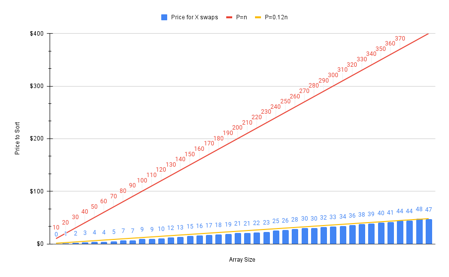

# Complexity of ClvrModel

If we decide to use ClvrModel to compute the optimal ordering on chain, we need to understand how much gas it consumes.

## Ordering Complexity

Currently, the ordering complexity is O(n^2) where n is the number of swaps.

## Sorting Complexity

Just noticed x axis does not have units, but each blue bar corresponds to +10 increase in array size. For example, the first one is array size of 10, the next one is 20, etc

